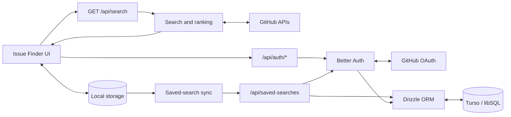

# OpenIssue.dev

[OpenIssue.dev](https://openissue-dev.vercel.app/) helps developers find active, contributor-friendly GitHub issues by technology.

## What it does

- Searches live GitHub issues by language or ecosystem topic
- Filters by contributor-friendly label, linked pull requests, and Hacktoberfest readiness
- Sorts and ranks results using activity, repository, assignment, and discussion signals
- Supports reusable saved searches without requiring an account
- Adds GitHub sign-in for cloud-backed saved searches that survive cleared browser storage
- Provides light, dark, and system themes with a responsive interface

## Quick start

Requirements: Node.js 22+, npm, a GitHub token, and a Turso database.

```bash
npm install
cp .env.example .env.local
npm run dev
```

Open [http://localhost:3000](http://localhost:3000). GitHub OAuth and database persistence require the additional configuration described in [Setup and deployment](doc/setup.md).

## Low-level design



See [Architecture and data flow](doc/architecture.md) for the expanded request flows, persistence model, and component relationships.

## Documentation

- [Setup and deployment](doc/setup.md)
- [Architecture and data flow](doc/architecture.md)
- [Development and contributing](doc/contributing.md)

## Tech stack

Next.js 16, React 19, TypeScript, Tailwind CSS, Better Auth, Drizzle ORM, Turso/libSQL, GitHub APIs, Vitest, Vercel, and SonarQube Cloud.

## License

Licensed under the [Apache License 2.0](LICENSE).
