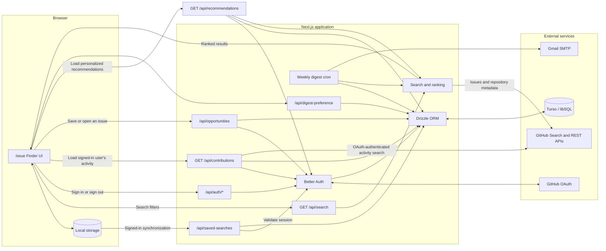

# Architecture and data flow

## Application overview

OpenIssue.dev uses the Next.js App Router. The main interface is a client component backed by route handlers for GitHub search, authentication, and saved-search persistence.

## Issue discovery

`GET /api/search` validates and rate-limits requests before querying GitHub. Languages use GitHub language qualifiers; framework and ecosystem terms such as React, Next.js, Spring Boot, and Kubernetes use repository topics.

Candidate issues are enriched where possible with repository metadata, recent discussion, assignment state, linked pull requests, and Hacktoberfest signals. Repository health uses recent pushes, open issue and pull-request activity, stars, forks, and issue-tracker availability to distinguish active, moderate, and stale projects. The health score contributes a small optional boost to issue quality ranking and is shown directly on issue cards. The application ranks the enriched results for contributor relevance and returns paginated results to the browser.

Maintainer responsiveness remains separate from repository health. For at most 12
candidate repositories per search, a cached six-hour GitHub GraphQL request samples
up to 20 recently updated issues and pull requests from the previous 90 days. The
summary considers the first response from an owner, member, or collaborator (while
excluding comments from the issue author), unanswered contributor-friendly issues,
recent closures, and the external pull-request merge ratio. A responsive status
requires at least half of sampled external pull requests to be merged when any are
present; multiple external pull requests with a merge ratio below 25% indicate a
slow repository. Fewer than four contribution
samples, missing authentication, repositories outside the bounded batch, and partial
GitHub failures produce `Unknown`. Responsive repositories receive a five-point
quality boost and variable repositories receive two points; repository health is
calculated and displayed independently.

Search responses report repository-metadata, discussion-analysis, and linked-PR
availability separately. Optional enrichment failures do not discard usable issue
results; the interface identifies partial data and score explanations omit signals
that were unavailable.

Search filters currently include:

- Technology or ecosystem
- Contributor-friendly label
- Trending, recently updated, most commented, or newest sorting
- Any, present, or absent linked pull request
- All issues or Hacktoberfest-ready issues
- Any experience, first contribution, beginner, or intermediate
- Documentation, tests, bug fix, or feature contribution type
- All scopes or small scope
- Any, responsive, variable, slow, or unknown maintainer responsiveness

Experience, contribution type, and scope classifications use explicit issue
labels and structured issue-template fields. Results show the signals that
produced a classification; issues without a strong matching signal remain
unclassified instead of receiving a guessed effort estimate.

Trending searches reuse the same technology and contributor-label filters, but
limit candidates to issues updated in the last 30 days. Results are ranked with
an explainable activity score combining recency, discussion volume, repository
stars, and repository health. The normal contributor-quality score remains
visible so users can balance momentum with issue suitability.

After a successful search, the browser URL stores the active filters without a
page reload. Opening a shared URL restores the filters and results, while browser
back and forward navigation restores prior searches. Pagination does not add
history entries.

## Authentication

Better Auth handles GitHub OAuth and stores users, provider accounts, and sessions in Turso through Drizzle. Authentication is optional for discovery and local saved searches.

Production uses `https://openissue-dev.vercel.app` as the OAuth proxy target. Allowed hosts include localhost, the production domain, and Vercel preview subdomains.

## Saved searches

Saved searches use a hybrid persistence model:

- Guests read and write browser `localStorage`.
- Signed-in users retain the same local behavior and synchronize with Turso.
- Existing local searches migrate after sign-in in batches of at most 100.
- Server records restore the local cache after browser data is cleared.
- Deletion is performed in Turso before the local record is removed.
- API queries and deletes are scoped to the authenticated user ID.
- Local data remains usable if cloud synchronization is temporarily unavailable.

## Contribution history

Authenticated users can view public GitHub issues and pull requests they opened,
ordered by the most recently updated activity. The protected contribution route
loads the user's stored GitHub OAuth token, resolves the current GitHub login,
and returns paginated GitHub search results with repository, type, status, and
direct links. Contribution history is shown in a separate authenticated tab and
is fetched only after that tab is selected. Ranked issue results remain the
default tab. Requests use the user's token and are not cached.

Individual opportunities are stored separately from saved-search filters. When a
signed-in user saves an issue or follows its GitHub link, `/api/opportunities`
upserts one compact record containing its canonical repository, issue number,
URL, title, and interaction timestamps. The unique user/repository/issue key
prevents repeated opens from creating duplicate rows. Contribution history is
still fetched live and is never copied into the database.

An authored issue is annotated when its canonical URL matches a saved or opened
opportunity. Pull requests are not matched by number alone because GitHub issue
and pull-request numbers can collide without representing related work.

## Personalized recommendations

Authenticated users select one saved search from their complete saved-search list as
the active recommendation preference; the most recent search is selected initially. The service
reuses the existing GitHub search and issue-quality ranking pipeline, deduplicates
issues across preferences, and excludes issues the user has already saved or
opened. Prior activity in the same repository contributes a small familiarity
boost. Each result displays its matching technology, label, and repository signal
so the ranking remains explainable. Saving or deleting a search directly changes
the preferences used the next time recommendations are loaded.

## Data model

The database contains Better Auth's `user`, `session`, `account`, and
`verification` tables plus application-owned saved searches, opportunities,
digest preferences, and repository-alert records. Opportunities reference
`user.id` with cascading deletion and store only compact issue identifiers and
interaction timestamps; GitHub contribution payloads are not persisted.

Schema definitions live in `src/lib/auth-schema.ts`; executable SQL is versioned under `db/migrations/`.

Normal application runtime code cannot execute DDL. The shared libSQL client
rejects schema-changing statements across single executions, batches, scripts,
and interactive transactions, and its migration API is disabled. A separate
privileged client is returned only after `getAdminDb(request)` authenticates the
request and verifies membership in the `admin` table. Source linting prevents
direct libSQL client imports outside `src/lib/db.ts`; planned schema changes
should still remain in the reviewed `db/migrations/` workflow.

## Weekly digest

Signed-in users can enable or disable a weekly digest. The preference and last
successful delivery timestamp are stored on the user record. A protected Vercel
Cron route runs each Monday, loads each opted-in user's saved searches, reuses
the existing GitHub search and ranking service, deduplicates the highest-ranked
issues, and sends a concise email through Gmail SMTP. Successful delivery updates
the timestamp so a retried cron invocation does not send a duplicate digest.
GitHub searches are constrained to the previous completed UTC Monday–Sunday week.
The job stores one aggregate snapshot per normalized search and week, allowing a
later digest to describe activity as rising, falling, or steady. The first
observation is explicitly presented as a baseline.

Digest issue links open GitHub directly. Saved-search links include the existing
filter query parameters; the issue finder reads those parameters and runs the
linked search on load. Weekly recommendations honor the saved responsiveness
filter and show each repository's status and sample size. Repository-alert
emails also show the cached responsiveness status, sample period, and
contributing signals beside each repository. Weekly recommendations display the
same quality and repository-health scores used to rank results in the portal.
Repository alerts enrich their newest issues with repository health and the same
quality formula before adding the repository responsiveness boost.
Saved-search recommendations, repository alerts, repository metadata, and
post-delivery persistence run concurrently where independent so SMTP delivery is
not delayed by avoidable serial network or database round trips.

Authenticated users can also request their own digest immediately from the
saved-search card. The manual route uses the same delivery pipeline and six-day
cooldown as the scheduled job, so a successful manual delivery counts as that
week's digest and subsequent requests during the delivery window are rejected.

Repository alerts are stored as one editable template per user with at most five
ordered repositories and a daily, weekly, or fortnightly frequency. GitHub
repository search powers the autocomplete. The cron runs daily, evaluates the
repository template's independent last-delivery timestamp, and continues to
send saved-search recommendations on Mondays. During
delivery, the service fetches the five newest open issues for every selection and
includes their title, summary, labels, creation date, assignment state, comment
count, and direct link. The delivered issue IDs are persisted only after a
successful email; a repository-only digest is not sent when every selection is
unchanged.

Users may store one optional alternate alert email on their account. Recipient
resolution happens in the shared delivery service, so saved-search and repository
alerts both prefer that address and fall back to the GitHub-linked email when it
is cleared.
